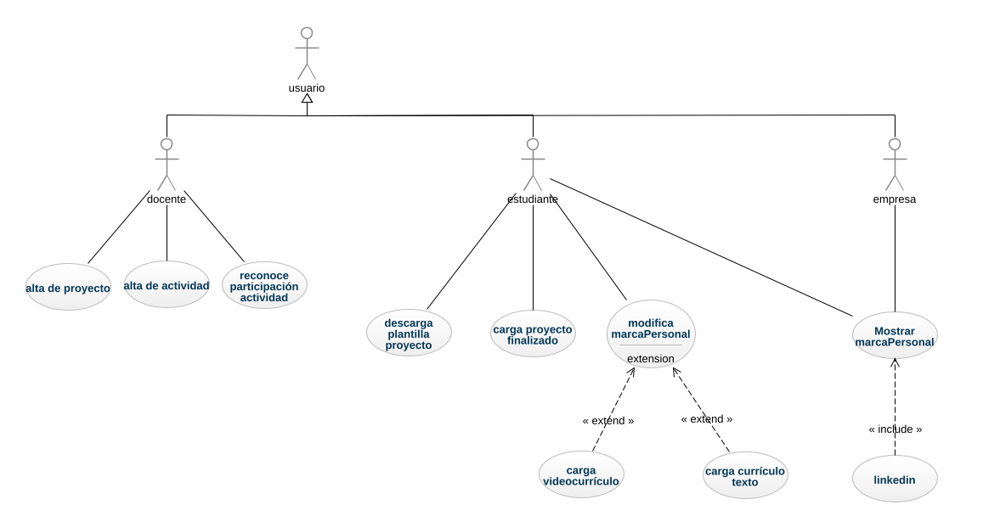

# Primeras vistas del proyecto

Vamos a desarrollar la página web [marcaPersonalFP.es](https://marcaPersonalFP.es).

Empezaremos por definir algunas rutas y vistas del sitio y en los siguientes sprints las iréis completando hasta terminar el sitio web completo.

## Definición del proyecto

El objetivo de este proyecto es la creación de una página web [marcaPersonalFP.es](https://marcaPersonalFP.es) en la que los estudiantes de Formación Profesional puedan publicar su currículo y los logros conseguidos a lo largo de su estancia en el centro.

El diagrama de casos de uso inicial que se plantea es el que se puede ver en la siguiente imagen:



Por su parte, la base de datos que dará soporte a la web seguirá el siguiente esquema:


## Inicialización del proyecto de código

// TODO pasos para la creación del repositorio inicial

Tenéis un repositorio disponible en GitHub, al cual le podéis crear un fork y gestionar con los PULL REQUEST que iréis generando a lo largo del proyecto. 

Este repositorio de Laravel se ha actualizado a la versión 8.2 de PHP y la versión 10.0 de Laravel.

Para poder ejecutar la aplicación con la versión 8.2 de PHP, también debéis actualizar Laradock. 

Para ello:

- parad los contenedores si están arrancados,
- acceded al directorio de Laradock, aseguraos de que el comando `git status` devuelve que está limpio y actualizarlo con `git pull origin master`
- eliminad el antiguo archivo `.env` y realizad una nueva copia del archivo `.env.example` como `.env`
- editad el archivo `.env` de laradock para modificar las siguientes variables de entorno:
```
    PHP_VERSION=8.2
    PMA_DB_ENGINE=mariadb
```
- ejecutad el comando
    `docker-compose up -d --build nginx mariadb phpmyadmin workspace`

## Definición de las rutas

En este ejercicio vamos a definir las rutas principales que va a tener nuestro sitio web.

Necesitaremos crear las vistas para poder realizar las operaciones **CRUD** sobre cada una de las tablas. De momento, las vistas únicamente deben devolver el texto con la _operación/visualización_ que deberán realizar en un futuro.

Las siguientes son las pantallas principales y un ejemplo del resultado del **CRUD** sobre la tabla 

 Ruta | Texto a mostrar
------|-------
/ | Pantalla principal
login | Login usuario
logout | Logout usuario
proyectos | Listado proyectos
proyectos/show/{id} | Vista detalle proyecto {id}
proyectos/create | Añadir proyecto
proyectos/edit/{id} |Modificar proyecto {id}

## Layout principal de las vistas con Bootstrap

En este ejercicio debéis esbozar el _layout_ base que van a utilizar el resto de vistas del sitio web.

Para desarrollar el _layout_ principal de nuestro sitio, creamos el fichero `resources/views/layouts/master.blade.php` y pondremos en él todo el contenido que se deba repetir en todas las páginas de nuestra aplicación.

## Crear el resto de vistas

En este ejercicio vamos terminar una primera versión estable de la web. En primer lugar crearemos las vistas asociadas a cada ruta, las cuales tendrán que extender del _layout_ que hemos hecho en el ejercicio anterior y mostrar (en la sección _content_ del _layout_) el texto de ejemplo que habíamos definido para cada ruta en el ejercicio anterior. En general, todas las vistas tendrán un código similar al siguiente (variando únicamente la sección _content_):
```
@extends('layouts.master')

@section('content')

    Pantalla principal

@stop
```

Para organizar mejor las vistas las vamos a agrupar en sub-carpetas dentro de la carpeta `resources/views` siguiendo la siguiente estructura:

Vista | Carpeta | Ruta asociada
------|---------|--------------
home.blade.php | resources/views/ | /
login.blade.php | resources/views/auth/ | login
index.blade.php | resources/views/proyectos/ | proyectos
show.blade.php | resources/views/proyectos/ | proyectos/show/{id}
create.blade.php | resources/views/proyectos/ | proyectos/create
edit.blade.php | resources/views/proyectos/ | proyectos/edit/{id}

Crearemos una vista separada para todas las rutas excepto para la ruta `logout`, la cual no tendrá ninguna vista asociada.

Por último vamos a actualizar las rutas del fichero `routes/web.php` para que se carguen las vistas que acabamos de crear. Acordaos que para referenciar las vistas que están dentro de carpetas la barra `/` de separación se transforma en un punto, y que además, como segundo parámetro, podemos pasar datos a la vista. A continuación se incluyen algunos ejemplos:
```
return view('home');
return view('proyectos.index');
return view('proyectos.show', array('id'=>$id));
```

Una vez hechos estos cambios ya podemos probarlo en el navegador, el cual debería mostrar en todos los casos la plantilla base con la barra de navegación principal y los estilos de Bootstrap aplicados. En la sección principal de contenido de momento solo podremos ver los textos que hemos puesto de ejemplo.
